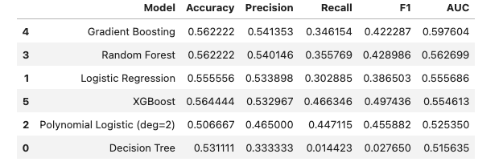
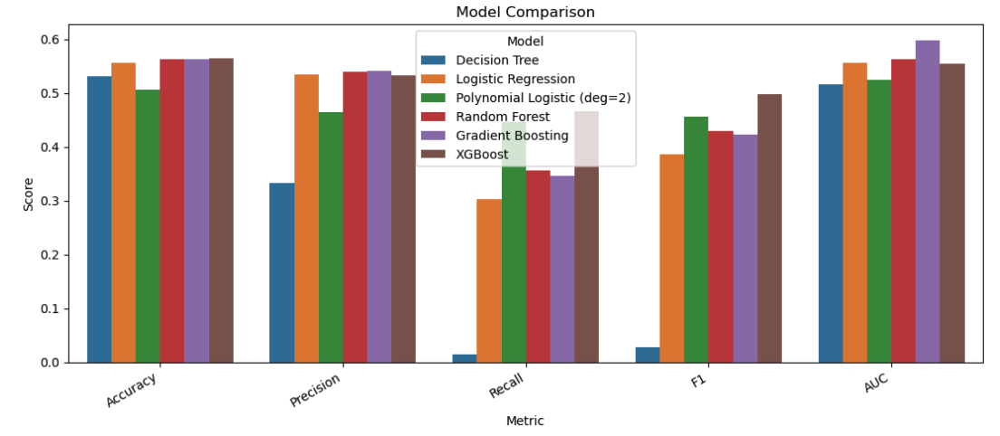
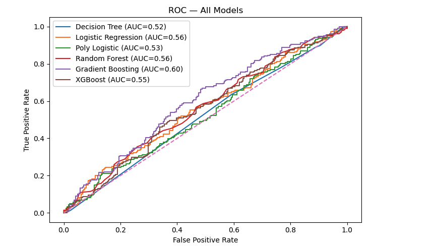
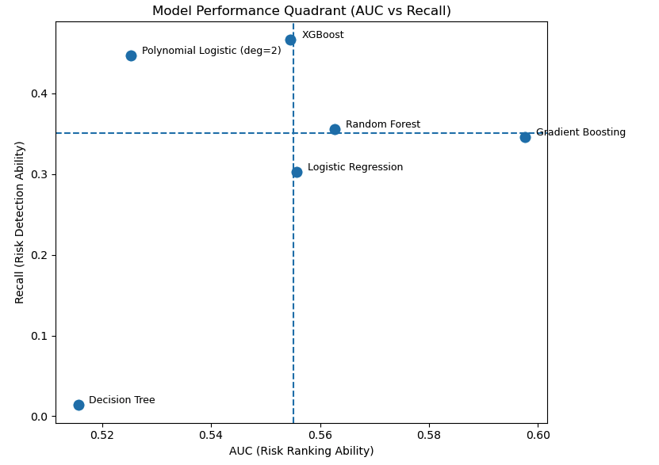
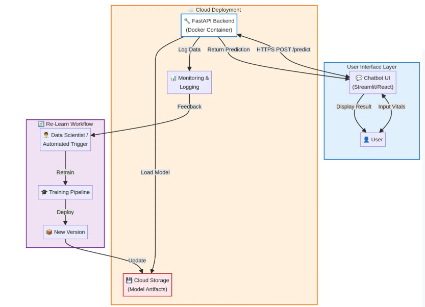

# Capstone Project : Heart Disease -  Risk Prediction #

## 1. Problem Context ##

India is dealing with a big rise in two major health issues: Type 2 Diabetes and heart disease.

These two problems are very connected. If you can't control your blood sugar, you're much more likely to have a heart attack. So, to deal with one, you have to understand the other.

The goal is to move from just reacting to emergencies (like a heart attack) to a more proactive approach. This means identifying people who are at high risk early on and helping them with preventative care to stop these problems before they start.

#### 1.1 Problem statement ####

"How accurately can we use Machine learning in creating a suitable model to predict heart attack risk for people in India? And when we look at all the health factors, just how much bigger of a red flag is diabetes compared to everything else?"

#### 1.2 Data Source ####

Dataset: https://www.kaggle.com/datasets/khushikyad001/heart-attack-risk-prediction-dataset-india

## 2. Exploratory Data analysis ##

#### 2.1: Prepare the data ####
     1. Load the heart-attack dataset and checked its shape (rows and columns).
     2. Review the target column to see how many low-risk and high-risk patients exist
     3. Checked for missing values and duplicate rows.
     4. This step helps make sure the data is clean enough to continue with analysis

#### 2.2 : Exploratory Data Analysis: Key Combinations (Cholesterol, Blood Pressure, Lifestyle) ####
- Initial Analysis showed that many individual features did not clearly separate low-risk and high-risk patients.
- Risk patterns became clearer when multiple factors were analyzed together.
- Based on this,  understanding how clinical factors and lifestyle factors interact becomes important in considering the risk factors

#### 2.3 : What and why - specific columns were selected ####
The following columns were used for combination analysis:
- Cholesterol (chol)
    - Important clinical indicator for heart disease.
    - Showed some signal in EDA but worked better when combined with other factors.
- Blood Pressure (trestbps)
    - Showed clearer separation between risk groups compared to many other features.
    - Clinically relevant and commonly used in risk assessment.
- Diabetes (diabetes)
    - Long-term health condition linked to heart disease.
    - Increased risk when present, especially with other factors.
- Smoking (smoking)
    - Known lifestyle risk factor.
    - Included to capture cumulative lifestyle effects, even though its individual impact was weaker in this dataset.
- Obesity (obesity)
    - Associated with higher cardiovascular risk.
    - Interacts with diabetes and cholesterol.

These variables represent a mix of clinical measurements and lifestyle conditions, which aligns with real-world heart-risk assessment.

#### 2.4 : How the combinations were created #### 
- Cholesterol and blood pressure were grouped into medically meaningful categories:
    - Normal
    - Borderline / Elevated
    - High
- Lifestyle risk was summarized using a combined score based on:
    - Diabetes
    - Smoking
    - Obesity
- Lifestyle groups were defined as:
    - No Lifestyle Risk Factors
    - One Lifestyle Risk Factor
    - Multiple Lifestyle Risk Factors
  
Above approach resulted easier risk calculation and clear data rather than analyzing too many individual variables.

## 3. Models - Performance interpretation  ##

To evaluate the performance and identify suitable model, following five metrics are used -
- Accuracy
- Precision
- Recall
- F1-Score
- AUC

#### 3.1 Accuracy - Indicates overall correctness ####
Accuracy measures the percentage of total predictions that were correct.
- Higher accuracy means the model correctly predicts more cases overall.
- However, accuracy alone can be misleading if the dataset has overlapping patterns or class imbalance.
- In healthcare prediction tasks, accuracy should be interpreted together with Recall and AUC.

#### 3.2 Precision - Shows prediction reliability ####
Precision measures how many of the predicted high-risk patients were actually high risk.

$$Precision = True Postive / Predicted Postive$$

- Higher the precision means, fewer false alarams
- Useful when false positives are costly
- Precision alone does not denote whether the model is missing high risk patients

#### 3.3 Recall - Measures risk detection ability ####
Recall measures how many of the actual high-risk patients were successfully detected by the model.

$$Recall = True Postive / Actual Postive$$

- Higher recall means the model detects more high-risk individuals.
- In healthcare, recall is often more important than accuracy because missing a high-risk patient can be serious.

#### 3.4 F1-Score - Balances precision and recall ####
F1-score is the harmonic mean of Precision and Recall.

$$F1 = 2 * ((Precision * Recall)/(Precision + Recall))$$

- Provides a balanced measure when both false positives and false negatives matter.
- Useful for comparing models when there is no single dominant metric.
- F1-scores were used to compare overall classification balance across models.

#### 3.5 AUC - Evaluates overall ranking performance ####
AUC measures how well the model separates high-risk and low-risk patients across all classification thresholds.

- Higher AUC indicates better ranking ability.
- AUC is especially useful when the goal is to prioritize high-risk patients rather than make a single yes/no decision.

## 4 Models  - Training and performance ##
Used a 60% train, 25% validation, and 15% test split.

#### 4.1 Baseline : Decision Tree ####
- Trained a simple Decision Tree model as a baseline.
- Evaluated the model using accuracy, precision, recall, and F1-score.
- The model achieved limited accuracy, which suggests underfitting.

#### 4.2 Logistic Regression ####
- This model predicts heart-attack risk using a linear combination of features.
- It is easy to understand and interpret.
- However, it assumes mostly linear relationships between features and the target.
- Because healthcare data often contains complex interactions, the model showed moderate performance.

#### 4.3 Polynomial Logistic Regression: ####
- Added Polynomial Features (degree = 2) before Logistic Regression.
- This allows the model to capture interaction effects between features.
- Compared to the basic Logistic Regression, this model improved recall, meaning it identified more high-risk patients.
- This shows that feature interactions are important for predicting heart-attack risk.

#### 4.4 Random Forest ####
- Random Forest is an ensemble method that builds many decision trees and combines their predictions.
- It automatically captures non-linear relationships and feature interactions.
- Compared to a single Decision Tree, Random Forest produced more stable and better overall performance.

#### 4.5 Gradient Boosting ####
- Gradient Boosting builds decision trees sequentially, where each new tree learns from the errors of the previous trees.
- It performs well for structured healthcare datasets because it can capture non-linear relationships and interactions between multiple risk factors.
- In this project, Gradient Boosting achieved strong overall ranking performance (high AUC) and maintained balanced Accuracy, Precision, and Recall.
- It serves as a reliable ensemble benchmark model for comparison.

#### 4.6 XGBoost ####
- XGBoost (Extreme Gradient Boosting) is an optimized implementation of the Gradient Boosting algorithm that improves training efficiency and predictive performance.
- In this project, XGBoost achieved the highest Recall, meaning it detected more patients who are at high risk of heart attack.
- It also maintained competitive AUC and Accuracy, indicating strong overall predictive capability.

## 5. Models  - Performance analysys ##

Since this project focuses on heart attack risk prediction, model evaluation must go beyond overall accuracy. In healthcare applications, the ability to correctly identify high-risk individuals is especially important because missing a high-risk patient (false negative) can lead to serious consequences.

#### 5.1 Performance Metrics Comparison ####

The table below summarizes the performance of all tested models on [the dataset](https://www.kaggle.com/datasets/khushikyad001/heart-attack-risk-prediction-dataset-india)

##### Observations #####

- Ensemble models (Random Forest, Gradient Boosting, XGBoost) **outperform single Decision Tree**.
- Decision Tree shows extremely **low Recall and is not suitable for this healthcare predictions**.
- Logistic Regression provides a **reasonable baseline but does not achieve strong detection performance**.
- Gradient Boosting achieves the **highest AUC**.
- XGBoost achieves **the highest Recall and highest F1-score**.
*While the table provides numerical comparison, visual analysis through ROC curves and quadrant plotting provides deeper insight into model behavior.*

#### 5.2 ROC analysis ####

The ROC curve illustrates the trade-off between True Positive Rate (Recall) and False Positive Rate across various classification thresholds. The Area Under the Curve (AUC) measures how well the model distinguishes between high-risk and low-risk individuals.

##### Observations #####

- Gradient Boosting shows the highest AUC (~0.60), indicating the strongest overall class separation.
- Random Forest and Logistic Regression show moderate discrimination.
- XGBoost maintains competitive AUC (~0.55).
- Decision Tree performs close to the diagonal line, indicating weak discrimination ability.

*Although Gradient Boosting demonstrates slightly stronger ranking performance, the differences among top models are relatively small.Therefore, additional emphasis is placed on Recall [**due to the healthcare usecase**] for final decision-making.*

#### 5.3 Model perfornace Quadrant (Magic Quadrant - AUC vs Recall)  ####
To better visualize the trade-off between ranking ability (AUC) and detection ability (Recall), a quadrant analysis was performed.

How to read the Magic Quadrant?
- The horizontal axis represents AUC (overall ranking ability).
- The vertical axis represents Recall (risk detection ability).
- The dashed lines indicate the average AUC and Recall across models.

##### Observations #####
- XGBoost appears in the upper region with the highest Recall.
- Gradient Boosting appears toward the right side with the highest AUC.
- Polynomial Logistic Regression shows moderate Recall but lower AUC.
- Decision Tree performs poorly on both metrics.

#### 5.4 AUC vs Recall #####
*AUC measures how well the model ranks or separates high-risk and low-risk individuals across all thresholds.*
*Recall measures how many actual high-risk individuals are correctly identified.*

Considering Health care problem in hand -

- **Missing a high-risk patient is unacceptable**: In preventive care, failing to identify a patient who needs attention (low Recall) means delayed diagnosis, missed interventions, and potentially serious consequences for their health.
- **"False positives" lead to further evaluation, not harm**: If a model flags someone as high-risk who turns out to be lower risk, it simply prompts a deeper look – which is part of good medical practice. It's a proactive step, not a detrimental one.
- **Recall directly supports patient safety and proactive care**: For clinicians, a model's ability to catch all the truly high-risk individuals is paramount. This aligns directly with our goal of intervening early and preventing adverse outcomes.
- **Model selection must prioritize clinical objectives**: The choice of model should be driven by the real-world impact on patients and the preventive goals of the project, not solely by abstract statistical metrics like AUC.

## 6. Conclusion  ##

** *Recommended model: XGBoost* **

Based on comprehensive analysis, XGBoost is recommended as the final model for the heart attack risk prediction system. This recommendation is driven by the following key findings:
- Performance Metrics: While the Gradient Boosting model demonstrated a marginally higher Area Under the Curve (AUC), XGBoost achieved the highest Recall and F1-score across evaluations, which included the performance table and ROC curve analysis.
- Clinical Alignment: Critically, the project's primary objective is the early identification of individuals at high risk of heart attack. This necessitates prioritizing the model's ability to successfully detect as many high-risk cases as possible (high Recall) over small improvements in overall ranking accuracy (AUC).
- Quadrant Analysis & Risk Priorities: Quadrant comparison further supported that XGBoost provided a more favorable balance in identifying true positives, directly aligning with clinical risk priorities where missing a high-risk patient carries significant implications.
  
### 6.1 Recommended model: ###
Considering the critical nature of early detection in preventive healthcare, XGBoost provides the optimal balance between predictive strength and clinical utility for the heart-attack risk prediction. Its superior Recall performance ensures that the system is best positioned to identify and enable intervention with high-risk patients effectively.

### 7. Next steps ###
- **Perform hyperparameter tuning on the selected XGBoost model** to further improve Recall and AUC by adjusting parameters such as learning rate, max depth, and number of trees.
- **Explore additional feature engineering**- including interaction features (e.g., combined clinical risk scores) to better capture relationships between cholesterol, blood pressure, and lifestyle factors.
- **Optimize the classification threshold to prioritize Recall**, since detecting high-risk patients is more important than maximizing overall accuracy in healthcare settings.
- **Test the model on external datasets** - to evaluate generalizability and robustness.
- **Incorporate additional variables** - such as medication history or genetic factors, to improve predictive performance and clinical relevance.

### 8. Deployment Strategy ###

The trained heart desease risk model will be deployed as a cloud-based prediction service along with 

- A chatbot-style web interface will collect patient vitals and lifestyle information (such as cholesterol, blood pressure, diabetes, smoking, and obesity).
    - The chatbot will securely send the input data to a FastAPI backend endpoint using HTTPS.
    - The backend will load the saved XGBoost model pipeline from cloud storage and generates a risk probability score & risk classification (High Risk / Low Risk)
  
- The system will include:
    - Basic authentication for secure access
    - Request logging and monitoring to track usage and errors
    - A clear medical disclaimer will be displayed to inform users that the prediction is only a screening tool and not a medical diagnosis.
**Below is teh model deployment view along with relearn feedback flow**

### References ###

1. https://www.ischool.berkeley.edu/research
2. https://www.kaggle.com/datasets/khushikyad001/heart-attack-risk-prediction-dataset-india
3. https://www.dailydoseofds.com/why-do-we-use-log-loss-to-train-logistic-regression/
4. https://www.escardio.org/communities/councils/cardiology-practice/scientific-documents-and-publications/sleep-apnoea-a-wake-up-call-for-cardiologists/
5. https://www.kaggle.com/code/ozgurozenn/hearth-attack-train-manuel-and-decisiontree
6. https://selfchec.org/selfchecks-heart.php?gad_source=1&gad_campaignid=203458804&gbraid=0AAAAADmkkqQdwNSMPsDOc2naTdSt3ljUD&gclid=CjwKCAiAzOXMBhASEiwAe14SacTCAkhFcT4iT9S0nyLIcLfstls_TnTz2SB74wVUMj-_MB-aWMbPMBoCzpMQAvD_BwE

